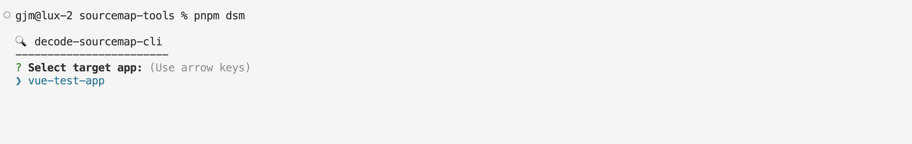
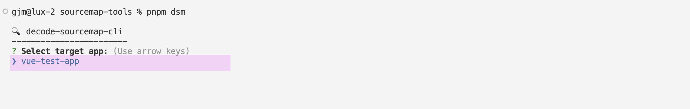
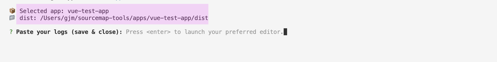
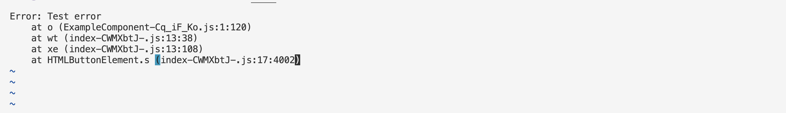
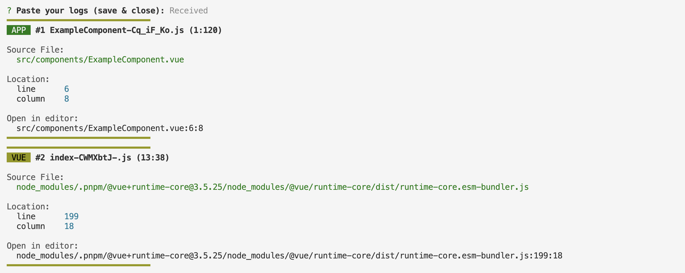
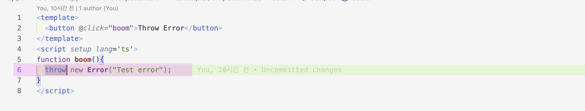

# decode-sourcemap-cli
A local CLI tool that converts production minified error stack traces back into original source locations using sourcemaps — **fully offline**, without any backend server.

<br />

## 1. Purpose — Why This Tool Exists

### 🏦 Background

Some environments (financial institutions, government systems, strict intranet setups, internal corporate networks, etc.) operate under heavy restrictions where:

- ❌ **Sourcemap files cannot be uploaded to servers**
- ❌ **External error monitoring SaaS is forbidden**
- ❌ **Frontend logs cannot leave the machine**
- ❌ **Backend APIs for decoding are not allowed**
- ❌ **Production error logs show only hashed/minified artifacts**

Example:

```
at ExampleComponent-Cq_iF_Ko.js:1:120
at index-CWMXbtJ-.js:13:38
```

<br/>

Debugging becomes extremely difficult because:

- The **original .vue/.ts file path** is unknown  
- The **source line/column number** is lost  
- The app runs in a **fully isolated environment**  

<br />

### 🎯 Goal

This CLI solves all of the above by enabling:

- ✔️ Source map decoding **locally**
- ✔️ No backend server or API  
- ✔️ No network calls  
- ✔️ Safe debugging inside isolated infra  
- ✔️ Use only local build artifacts (`dist/*.js`, `.map`)  

In short:

> **This is an offline sourcemap decoder for restricted environments where “developer laptop = debugging server.”**

<br /><br />

## 2. How Developers Use This Tool When an Error Occurs

1. Build the app locally (you now have minified files + sourcemaps).  
2. Copy the error from browser console or log collector.  
3. Run `dsm` and paste the logs.  
4. The CLI finds the `.map` file and decodes the minified stack trace.  

Result includes:

- Original file path  
- Line & column number  
- Code location  
- Terminal-clickable file path  
- Optional Git-blame info  

<br /><br />

## 3. Installation

```bash
pnpm install
pnpm build
pnpm link --global
```

Run:

```bash
dsm
```

<br /><br />

## 4. CLI Workflow (Step-by-Step)

### ▶️ Step 1: Run the CLI

```bash
pnpm dsm
```

You will see:




### ▶️ Step 2: Select target app

Use arrow keys:




### ▶️ Step 3: Dist folder resolved automatically




### ▶️ Step 4: Paste your error logs

Example:




### ▶️ Step 5: Decoded Result




### ▶️ Step 6: Navigate to exact error location



<br /><br />

## 5. CLI Options

| Option | Description |
|---|---|
| `--html <file>` | Export HTML report |
| `--no-color` | Disable colored output |
| `--raw` | Output plain format |

<br />

Example:

```bash
dsm --html report.html
```

<br /><br />

## 6. Why This Tool Is Ideal for Restricted Network Environments

| Environment | Problem | Tool Solution |
|----|----|-------|
| No backend allowed | Cannot upload sourcemaps | Decode locally |
| No external network | Cannot use Sentry, Datadog | Zero network dependencies |
| Security compliance | No source code exposure | All decoding stays on your laptop |

<br /><br />

## 7. Summary

`decode-sourcemap-cli` provides:

- 🌐 **100% offline sourcemap decoding**
- 🎨 Colorized output
- 📂 Clickable file navigation
- 📝 HTML report generation
- 👤 Git blame integration
- 🛡️ Ideal for restricted environments

